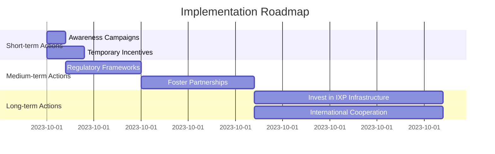

# Internet Ecosystem Resilience and Infrastructure Policy Report for FR

## Executive Summary

The current state of the peering ecosystem in FR indicates a moderate level of local traffic exchange efficiency, with a Peering Efficiency Ratio of 22.63%. This ratio, which measures the density of the local peering ecosystem, suggests that while there is some local traffic exchange, there is significant room for improvement. Key findings include a total of 2205 Autonomous Systems (AS) in the country, with only 499 participating in local peering through Internet Exchange Points (IXPs). This low participation rate highlights a critical issue in the resilience of the national internet infrastructure, as it indicates a heavy reliance on international transit for a substantial portion of internet traffic.

The overall resilience assessment reveals that FR's internet ecosystem is not fully optimized for local traffic exchange, which can lead to increased latency and higher costs associated with international transit dependencies. Addressing this gap is crucial for enhancing the robustness and efficiency of the national internet infrastructure.

## Technical Analysis

### Data Interpretation

The Peering Efficiency Ratio of 22.63% indicates that only about one-fifth of the total AS in FR are participating in local peering. This low ratio suggests that a significant amount of internet traffic is routed through international transit providers rather than being exchanged locally. This inefficiency can lead to higher latency, increased costs, and reduced control over traffic routing.

### Vulnerabilities and Strengths

**Vulnerabilities:**
- **Low Peering Participation:** Only 499 out of 2205 AS are engaged in local peering, indicating a lack of incentives or awareness among network operators.
- **Dependency on International Transit:** The low peering ratio suggests a high reliance on international transit, which can introduce latency and increase operational costs.
- **Lack of Dynamism:** The absence of temporal data on new entrants to local peering makes it difficult to assess the growth and dynamism of the ecosystem.

**Strengths:**
- **Existing Peering Infrastructure:** The presence of 499 AS in local peering indicates that there is an established foundation for local traffic exchange.
- **Potential for Growth:** With 2205 total AS, there is a significant opportunity to increase peering participation and improve the efficiency of the ecosystem.

### Comparison with International Best Practices

International best practices in countries with mature internet ecosystems show Peering Efficiency Ratios closer to 50% or higher. These countries often have robust policies and incentives that encourage local peering, such as reduced costs, improved performance, and enhanced control over traffic routing. FR can learn from these examples to develop strategies that promote local peering and reduce dependency on international transit.

### Root Cause Analysis

The low Peering Efficiency Ratio can be attributed to several factors:
- **Lack of Incentives:** Network operators may not see sufficient benefits in joining local IXPs due to costs, technical complexities, or perceived lack of value.
- **Market Concentration:** Dominant transit providers may discourage local peering by offering competitive pricing or bundled services.
- **Regulatory Gaps:** Absence of policies that promote local peering and incentivize network operators to participate in IXPs.

## Risk Assessment

### Technical Risks
- **Infrastructure Dependencies:** High reliance on international transit introduces risks associated with infrastructure failures or disruptions in other countries.
- **Latency Issues:** International routing can increase latency, affecting the performance of real-time applications and services.

### Operational Risks
- **Lack of Diversity:** Concentration of traffic through a few major transit providers can lead to single points of failure.
- **Cost Inefficiencies:** International transit is generally more expensive than local peering, leading to higher operational costs.

### Strategic Risks
- **International Dependencies:** Heavy reliance on international transit providers can expose the national internet infrastructure to geopolitical risks and governance gaps.
- **Governance Gaps:** Absence of policies that promote local peering can hinder the development of a resilient internet ecosystem.

## Actionable Recommendations

### Short-term Actions (0-12 months)

| Action | Complexity | Cost | Impact | Timeline | Stakeholders | KPIs |
|--------|-----------|------|--------|----------|--------------|------|
| Conduct awareness campaigns to promote the benefits of local peering | LOW | LOW | MEDIUM | 0-6 months | Government, Industry Associations | Number of new AS joining IXPs |
| Provide temporary incentives (e.g., reduced fees) for new entrants to IXPs | MEDIUM | MEDIUM | MEDIUM | 0-12 months | IXP Operators, Government | Increase in Peering Efficiency Ratio |

### Medium-term Actions (1-3 years)

| Action | Complexity | Cost | Impact | Timeline | Stakeholders | KPIs |
|--------|-----------|------|--------|----------|--------------|------|
| Develop and implement regulatory frameworks that promote local peering | HIGH | MEDIUM | HIGH | 1-2 years | Government, Regulatory Bodies | Increase in Peering Efficiency Ratio, Reduction in international transit dependency |
| Foster partnerships between local ISPs and content providers to encourage local traffic exchange | MEDIUM | MEDIUM | MEDIUM | 1-3 years | ISPs, Content Providers, IXP Operators | Increase in local traffic volume, Improved latency metrics |

### Long-term Actions (3-5 years)

| Action | Complexity | Cost | Impact | Timeline | Stakeholders | KPIs |
|--------|-----------|------|--------|----------|--------------|------|
| Invest in expanding IXP infrastructure to accommodate more participants | HIGH | HIGH | HIGH | 3-5 years | Government, Private Investors, IXP Operators | Increase in Peering Efficiency Ratio, Enhanced network performance metrics |
| Establish international cooperation agreements to promote regional peering and reduce transit dependencies | HIGH | MEDIUM | HIGH | 3-5 years | Government, International Organizations | Increase in regional peering agreements, Reduction in international transit costs |

## Implementation Roadmap

### Priority Matrix

| Action | Priority | Dependencies | Timeline |
|--------|----------|--------------|----------|
| Conduct awareness campaigns | High | None | 0-6 months |
| Provide temporary incentives | High | None | 0-12 months |
| Develop regulatory frameworks | Medium | Awareness campaigns | 1-2 years |
| Foster partnerships | Medium | Regulatory frameworks | 1-3 years |
| Invest in IXP infrastructure | Low | Regulatory frameworks, Partnerships | 3-5 years |
| Establish international cooperation | Low | Regulatory frameworks, Partnerships | 3-5 years |

### Suggested Timeline Visualization

## Success Metrics

### Quantifiable Targets

**Short-term (0-12 months):**
- Increase the Peering Efficiency Ratio by 5%
- Attract at least 100 new AS to join IXPs

**Medium-term (1-3 years):**
- Achieve a Peering Efficiency Ratio of 35%
- Reduce international transit dependency by 10%

**Long-term (3-5 years):**
- Achieve a Peering Efficiency Ratio of 50%
- Establish at least 3 new regional peering agreements

### Monitoring Mechanisms

- Regular audits of IXP participation and traffic volume
- Quarterly reviews of Peering Efficiency Ratio and international transit dependency
- Annual stakeholder meetings to assess progress and address challenges

### Review Schedule

- Quarterly progress reviews
- Annual comprehensive assessments
- Bi-annual stakeholder consultations to adjust strategies as needed